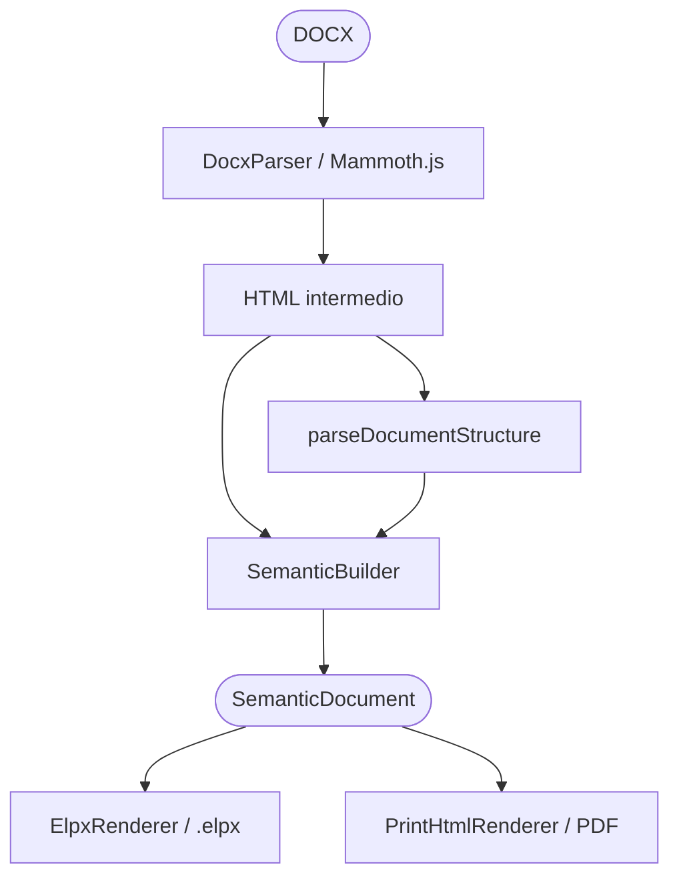
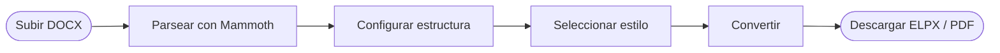
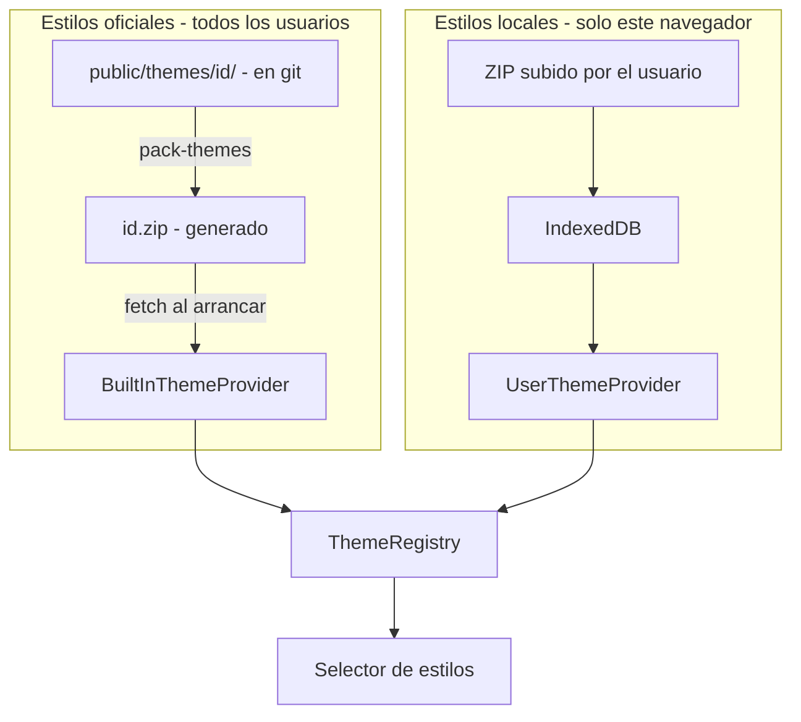

# BUA ConvertidoreXe — DOCX → eXeLearning + PDF

**ConvertidoreXe v0.2.0**. Aplicación web que convierte documentos Word a proyectos eXeLearning (ELPX) y a PDF con un tema visual a elegir. Todo el procesamiento sucede en el propio navegador; no hay servidor que reciba los archivos.

Desarrollado por la Biblioteca Universitaria de la Universidad de Alicante.
Licencia: GNU GPL v3.0.
Versión en vivo: https://marioflorido.github.io/BUA-convertidor-exe/

---

## Qué hace

1. Subes un documento Word (DOCX).
2. Configuras la jerarquía: qué hace cada H1 y cada H2.
3. Eliges un tema visual.
4. Descargas el `.elpx` para abrirlo en eXeLearning.
5. Exportas a PDF con portada, índice, encabezados, pies y los estilos del tema.

No hay servidor backend. El documento que subes nunca sale de la pestaña del navegador.

---

## Arquitectura: pipeline de tres capas



El **SemanticDocument** es el modelo central. Describe el documento como páginas y bloques, sin asumir nada sobre el formato final. Los renderers ELPX y PDF son piezas independientes: añadir un nuevo formato (SCORM, EPUB…) es escribir un renderer adicional sin tocar lo demás.

---

## Inicio rápido

### Requisitos
- **Node.js** ≥ 18
- **npm** ≥ 9

### Instalación

```bash
git clone https://github.com/MarioFlorido/BUA-convertidor-exe.git
cd BUA-convertidor-exe
npm install
```

### Desarrollo

```bash
npm run dev          # Vite dev server con HMR
```

Accede a `http://localhost:5173/BUA-convertidor-exe/`

### Build

```bash
npm run build        # Compilación de producción → dist/
npm run preview      # Previsualizar el build
npm run deploy       # Publicar en GitHub Pages
```

---

## Estructura del proyecto

```
src/
├── App.tsx                            # Orquestador del wizard (5 pasos)
├── main.tsx                           # Entry point: arranca ThemeBoot → React
│
├── components/                        # Interfaz de usuario
│   ├── AppHeader.tsx                  # Cabecera con logo BUA + botón Temas
│   ├── StepIndicator.tsx              # Indicador de progreso del wizard
│   ├── UploadZone.tsx                 # Carga drag-and-drop del DOCX
│   ├── StructureConfigurator.tsx      # Configurar nivel de H1 y opción de H2
│   ├── ThemeSelector.tsx              # Elegir tema visual
│   ├── ThemeManager.tsx               # Administrar temas (cargar/eliminar)
│   ├── DownloadButton.tsx             # Descargar ELPX + exportar PDF + switch portada
│   └── ConfigPanel.tsx                # Opciones globales
│
├── core/
│   ├── boot/
│   │   └── ThemeBoot.ts               # Secuencia de arranque del sistema de temas
│   │
│   ├── models/
│   │   └── SemanticDocument.ts        # Modelo central agnóstico al formato
│   │
│   ├── parsers/
│   │   └── DocxParser.ts              # DOCX → HTML (Mammoth)
│   │
│   ├── parseStructure.ts              # HTML → árbol H1/H2/H3/H4
│   │
│   ├── builders/
│   │   └── SemanticBuilder.ts         # Árbol H1/H2 → SemanticDocument
│   │
│   ├── transformers/
│   │   └── HtmlTransformer.ts         # Aplica clases BUA: [importante]/[ejemplo]/[definición]
│   │
│   ├── docxToSemanticDocument.ts      # Orquestador Capa 1
│   │
│   ├── converters/
│   │   └── semanticDocumentToElpx.ts  # Orquestador Capa 2a
│   │
│   ├── renderers/
│   │   ├── ElpxRenderer.ts            # Genera content.xml del .elpx
│   │   │
│   │   └── html-print/                # Renderer Capa 2b (PDF)
│   │       ├── semanticDocumentToPrintHtml.ts
│   │       ├── PrintThemeLoader.ts    # Carga assets (logos, colores, portada)
│   │       ├── renderCoverPage.ts     # Portada con imagen + licencia CC
│   │       ├── renderTableOfContents.ts
│   │       └── printStyles.css        # CSS Paged Media (@page, running elements)
│   │
│   └── services/                      # Sistema de temas 100% client-side
│       ├── ThemeRegistry.ts           # Fuente de verdad única (singleton)
│       ├── ThemeBundle.ts             # Tipos de los temas
│       ├── ThemeValidator.ts          # Validación + filtrado de archivos sistema
│       ├── BuiltInThemeProvider.ts    # Temas oficiales desde public/ + themes-config.json
│       ├── UserThemeProvider.ts       # Temas locales del usuario (IndexedDB)
│       ├── ThemeClientService.ts      # Carga ZIPs en el cliente con fflate
│       ├── ThemeCssManager.ts         # Inyecta CSS del tema activo en <head>
│       ├── ThemeOrderService.ts       # Orden personalizado (drag-and-drop · localStorage)
│       ├── themeConfigParser.ts       # Lee <language> de config.xml + screenshot del ZIP
│       ├── PreviewService.ts          # Construye la vista previa del HTML del documento
│       ├── BlobUrlRegistry.ts         # Gestión de blob: URLs
│       └── ThemeService.ts            # Facade legacy del sistema de temas
│
├── styles/
│   └── globals.css                    # Tokens de diseño + estilos UI
│
└── types/
    └── index.ts                       # Tipos compartidos

scripts/
├── publish-theme.ts                   # Publicar un ZIP de tema en public/ + JSON
└── unpublish-theme.ts                 # Retirar un tema oficial del repo

public/
├── base.elpx                          # Plantilla base eXeLearning (no borrable)
├── themes-config.json                 # Catálogo de temas oficiales (índice)
├── docs/guia-temas.html               # Guía del usuario final (enlazada en la UI)
├── logo_BUA.png · logo_UA.png · logo_CID.png
└── themes/                            # Carpetas descomprimidas (vacía si no hay oficiales)

docs/
├── architecture/ARCHITECTURE.md       # Documentación técnica detallada
├── gestion-temas-oficiales.md         # Guía de administración (scripts, errores típicos)
└── COMPARISON.md                      # Comparación con otras herramientas
```

---

## Flujo del wizard



| Paso | Descripción |
|------|-------------|
| **1 Upload** | Cargar .docx |
| **2 Structure** | Por cada H1, elegir nivel jerárquico. Por cada H2: iDevice / HTML / Acordeón / Pestañas |
| **3 Theme** | Elegir estilo visual |
| **4 Convert** | DOCX → SemanticDocument → ELPX (en cliente) |
| **5 Download** | Descargar `.elpx` · Exportar PDF con portada opcional (Paged.js) |

---

## Etiquetas semánticas BUA en el DOCX

Dentro del documento Word puedes marcar cajas semánticas:

```
[Importante]
Contenido del bloque importante.
[fin]

[ejemplo]
Texto del ejemplo.
[fin]

[definición]
Texto de la definición.
[fin]
```

Y clases de tabla aplicadas a la siguiente tabla:

```
[horizontal]   →  tabla horizontal estilizada
[vertical]     →  tabla vertical estilizada
```

Los colores, etiquetas (multilingües) y estilos vienen del CSS del tema activo. La detección es robusta frente a las particularidades de Word:
- Case-insensitive: `[IMPORTANTE]`, `[Importante]`, `[importante]`
- Tildes: `[definición]` ≡ `[definicion]`
- Bookmarks invisibles de Word (`<a></a>`) dentro de los corchetes — se limpian automáticamente
- `[horizontal]` y `[vertical]` entre dos cajas no rompen la detección de la segunda
- Saltos de línea (Shift+Enter) junto a marcadores se normalizan a saltos de párrafo

---

## Sistema de temas

### Dos categorías



| Tipo | Vive en | Visible para | Cómo se gestiona |
|---|---|---|---|
| **Base** (oficial, fijo) | Repo: `public/base.elpx` | Todos los usuarios | Inmutable, no borrable |
| **Oficiales** | Repo: `public/themes/<id>/` + `themes-config.json` | Todos los usuarios | `npm run themes` |
| **Locales** | IndexedDB del navegador | Solo ese usuario | UI "Importar estilo local" |

### Estructura de un ZIP de tema

```
{ThemeId}.zip/
├── style.css                  # CSS del tema (REQUERIDO)
│                              # Debe incluir clases .bua_ejemplo, .bua_definicion,
│                              # .bua_importante con ::before { content: "Etiqueta" }
├── style.js                   # JavaScript del tema (opcional)
├── config.xml                 # Metadatos · <language>es|ca|en</language>
├── screenshots.png            # Miniatura del selector (recomendado 1200×500)
│                              # Se acepta también screenshot.png (singular)
├── portada_pdf.png            # (opcional) Imagen A4 para portada PDF
└── img/
    ├── logo_BUA.png           # Encabezado del PDF + portada
    ├── logo_UA.png            # Pie del PDF
    └── logo_CID.png           # (opcional)
```

El ZIP puede tener los archivos en la raíz o agrupados dentro de una carpeta única (`{id}/style.css`). Ambas estructuras se aceptan.

### Cargar un tema local desde la UI

Pulsa **Importar tema local** en la cabecera y arrastra el ZIP al recuadro (o haz clic para abrir el selector). El tema se valida, se guarda en IndexedDB y queda disponible al momento. Si más tarde subes otro ZIP con el mismo ID, sustituye al anterior.

Los temas locales no salen del navegador. Para que un tema esté disponible para el resto del equipo hay que publicarlo en el repositorio, como se explica abajo.

### Reordenar temas (drag-and-drop)

En el gestor de temas cada fila lleva un mango (`≡`) a la izquierda. Arrastra para subir o bajar; el orden se persiste en `localStorage` y se respeta también en el selector de temas del wizard. Los temas nuevos aparecen al final.

### Publicar un tema oficial (admin)

```bash
npm run publish-theme /ruta/al/MiTema.zip
git add -A public/ && git commit -m "feat(themes): publicar MiTema" && git push
```

El script copia el ZIP a `public/`, lo descomprime en `public/themes/<id>/` para que la miniatura quede accesible, y añade la entrada en `themes-config.json`. No hace el commit por ti; te muestra el comando exacto que falta. Cuando empujes los cambios, GitHub Pages redespliega en uno o dos minutos y el tema aparece para cualquiera que recargue la página.

Para retirarlo:
```bash
npm run unpublish-theme <id>
```

Documentación completa: [docs/gestion-temas-oficiales.md](docs/gestion-temas-oficiales.md). Guía del usuario final: [public/docs/guia-temas.html](public/docs/guia-temas.html) (enlazada desde la UI).

---

## El PDF generado

| Elemento | Descripción |
|----------|-------------|
| **Portada** | Imagen `portada_pdf.*` (opcional, switch en la UI; por defecto desactivado) + logo BUA + título + año + licencia CC |
| **Índice** | TOC paginado automáticamente vía `target-counter()` de Paged.js |
| **Encabezado** | Logo BUA (izquierda) + título del documento (derecha) en cada página de contenido |
| **Pie de página** | Logo UA (izquierda) + número de página (centro) |
| **Cajas BUA** | `bua_ejemplo`, `bua_definicion`, `bua_importante` con colores y etiquetas del tema. Sangradas 25 px a cada lado para destacar respecto a los párrafos colindantes |
| **iDevices con título** | Cabecera coloreada + borde perimetral |
| **Tablas** | Cabecera coloreada con los tokens del tema |
| **Imágenes** | Centradas con sombra sutil |
| **Acordeones/Pestañas** | Expandidos en impresión, sin solapamiento |

### Detección de idioma del tema (3 capas)

1. **Etiquetas BUA del CSS**: `"Exemple"`→CA · `"Example"`→EN · `"Ejemplo"`→ES (más fiable)
2. **Palabras clave del ID**: `PhD`→EN · `Doctorat`/`Grau`/`Màster`→CA
3. **Fallback**: `es`

---

## Despliegue

Cada push a `main` lanza una GitHub Action que construye el proyecto y publica el resultado en GitHub Pages. La configuración está repartida en tres sitios:

- `vite.config.ts` → `base: '/BUA-convertidor-exe/'`
- `.github/workflows/deploy.yml` → build + deploy automático
- Branch `gh-pages` → contiene el build estático

Para desplegar manualmente:

```bash
npm run deploy
```

---

## Dependencias principales

| Paquete | Uso |
|---------|-----|
| `mammoth` | DOCX → HTML |
| `fflate` | Compresión/descompresión ZIP (ELPX y temas) |
| `idb` | Wrapper de IndexedDB para persistir temas de usuario |
| `react` + `react-dom` | UI |
| `Paged.js` (CDN) | CSS Paged Media polyfill para PDF |

---

## Comandos

| Comando | Descripción |
|---------|-------------|
| `npm run dev` | Servidor de desarrollo (Vite + HMR) en puerto 5173 |
| `npm run build` | Build de producción (TypeScript + Vite) → `dist/` |
| `npm run preview` | Previsualizar el build de producción |
| `npm run lint` | ESLint con reporte de directivas no usadas |
| `npm run deploy` | Build + publicación manual en `gh-pages` (normalmente automático vía GitHub Actions) |
| `npm run publish-theme <ruta.zip>` | Publica un tema oficial: copia ZIP, descomprime, actualiza JSON |
| `npm run unpublish-theme <id>` | Retira un tema oficial: borra ZIP, carpeta y entrada del JSON |

---

## Problemas habituales

**"No se pudo cargar la plantilla base"**
Falta `public/base.elpx`. Restaurar con `git checkout public/base.elpx`.

**"Error al cargar idb"**
Falta la dependencia. Ejecuta `npm install`.

**"El tema no aparece en el selector tras subirlo"**
La validación falló (ZIP sin `style.css` o con estructura inválida). Mira la consola del navegador.

**"El tema se carga pero no muestra miniatura"**
El ZIP no incluye `screenshots.png` (plural — convención BUA) ni `screenshot.png` en la raíz o subcarpeta del tema. El tema funciona igual, pero sin imagen en el selector.

**"La interfaz dice [ES] pero el tema es en inglés o catalán"**
Falta la etiqueta `<language>` en el `config.xml` del tema. Añadir `<language>en</language>` o `<language>ca</language>` y re-empaquetar.

**"El PDF no muestra encabezados/pies"**
Paged.js requiere conectividad para cargar desde CDN (`unpkg.com`). Para entornos offline, descarga Paged.js localmente y actualiza la URL en `semanticDocumentToPrintHtml.ts`.

**"Las cajas BUA no tienen colores en el PDF"**
El `style.css` del tema debe declarar `.bua_ejemplo`, `.bua_definicion`, `.bua_importante` con `border-left: Npx solid #color` y `::before { content: "Etiqueta" }`.

**"Página en blanco antes/entre secciones del PDF"**
Si modificas la posición de los running elements en `semanticDocumentToPrintHtml.ts`, debes mantenerlos DENTRO de `<section class="cover-page">` — fuera, generan páginas anónimas por la transición de named-pages.

---

## Inspiración y agradecimientos

Este proyecto se inspira en el trabajo de [Juanjo de Haro](https://hackexe.tiddlyhost.com/#HACKeXe:HACKeXe) sobre HACKeXe. En [docs/COMPARISON.md](docs/COMPARISON.md) hay una comparación detallada entre ambas herramientas.

---

## Estado del proyecto

| Funcionalidad | Estado |
|---|---|
| Conversión DOCX → ELPX | ✅ |
| Sistema de temas client-side con IndexedDB | ✅ |
| Configurador de estructura H1/H2 | ✅ |
| Opciones H2: iDevice / HTML / Acordeón / Pestañas | ✅ |
| Etiquetas semánticas [importante]/[ejemplo]/[definición] | ✅ |
| Robustez frente a bookmarks de Word en etiquetas | ✅ |
| Robustez frente a Shift+Enter cerca de marcadores | ✅ |
| Robustez frente a `[horizontal]`/`[vertical]` entre cajas | ✅ |
| Renderer PDF (Paged.js) con portada/índice/encabezado/pie | ✅ |
| Cajas semánticas sangradas lateralmente en el PDF | ✅ |
| Switch para activar/desactivar imagen de portada (off por defecto) | ✅ |
| Detección automática de idioma del tema (ES/EN/CA) desde `config.xml` | ✅ |
| Miniaturas en el selector y gestor de temas | ✅ |
| Reordenación drag-and-drop de temas (persistente) | ✅ |
| Scripts `publish-theme` / `unpublish-theme` para temas oficiales | ✅ |
| Guía del usuario final (HTML) enlazada desde la UI | ✅ |
| Guía de administración (Markdown) en `docs/` | ✅ |
| Despliegue automático en GitHub Pages | ✅ |
| Metadatos ELPX (autoría BUA, licencia CC BY-NC-SA) | ✅ |

---

**Repositorio:** https://github.com/MarioFlorido/BUA-convertidor-exe
**Documentación técnica:** [docs/architecture/ARCHITECTURE.md](docs/architecture/ARCHITECTURE.md)
**Changelog:** [CHANGELOG.md](CHANGELOG.md)
