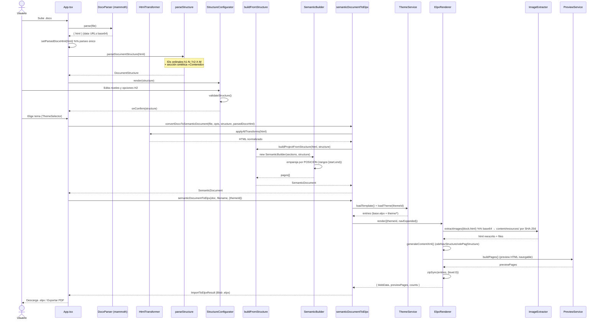

# INFORME DE AUDITORÍA TÉCNICA Y ARQUITECTURA
## BUA-convertidor-exe · v0.3.0 · «ConvertidoreXe»

> **Fecha:** 2026-06-19 · **Metodología:** lectura íntegra de `src/` (≈9.500 LoC TS/TSX, 60 ficheros), `vite.config.ts`, `.github/workflows/deploy.yml`, `scripts/`, `package.json`; ejecución de la suite (`npm test` → **102/102 pass**). Las referencias apuntan a `fichero:línea`. Documento concebido como **Single Source of Truth (SSOT)** del estado del proyecto.
>
> **NOTA:** este informe se generó ANTES de la tanda de refactor P0/P1/P2 documentada en `CHANGELOG.md`. Algunos hallazgos de §13 (escHtml ×3, up-case h2 ×3, NFD ×4, `BUA_CLASSES` huérfana, `loadThemeIfNeeded` muerto, invariante posicional sin test, Node CI/dev) **ya están corregidos** en la rama `chore/auditoria-p0-p1-p2`. Se conserva el texto original como foto del punto de partida.

---

## 1. CONTEXTO Y OBJETIVOS DEL PROYECTO

**Propósito de negocio.** Herramienta web de la Biblioteca de la Universidad de Alicante (BUA) que convierte documentos **Word (`.docx`)** en **proyectos de eXeLearning (`.elpx`)** maquetados con la identidad visual institucional, más una **vista de impresión / PDF** del mismo contenido. Elimina la maquetación manual: el autor escribe en Word con convenciones mínimas (`[ejemplo]…[fin]`, `[horizontal]` antes de una tabla) y obtiene un curso listo.

**Problema técnico que resuelve.** eXeLearning no importa Word. El núcleo es un **mapeo semántico no trivial**: traducir la jerarquía de encabezados (H1–H4), las cajas de contenido y los recursos embebidos al modelo propietario de eXeLearning (`content.xml` con `odeNavStructure`/`odePagStructure`/`odeComponent` + páginas HTML de *preview* + recursos extraídos), aplicando un tema institucional. El usuario decide en un asistente cómo se proyecta cada H2 (título de iDevice, cabecera en texto, acordeón o pestañas).

**Objetivos de alto nivel observados en el código:**
- **Cero backend / portabilidad total.** Todo corre en el navegador y se despliega como sitio estático en GitHub Pages (`vite.config.ts:69`, `base: '/BUA-convertidor-exe/'`). Sin servidor, secretos ni base de datos. Persistencia local: IndexedDB (temas de usuario) y `localStorage` (preferencias/orden).
- **Funcionamiento offline.** Mammoth, Paged.js (`?raw` inline) y la fuente Inter (`@fontsource`) se empaquetan; sin CDN en runtime.
- **Mantenibilidad sobre rendimiento.** Arquitectura por capas con modelo intermedio agnóstico al formato (`SemanticDocument`). El volumen es bajo (un curso; 3–4 familias de temas).
- **Operación sin Terminal.** Panel de administración que publica temas oficiales vía la GitHub Git Data API.

---

## 2. ANÁLISIS ARQUITECTÓNICO DETALLADO

**Estilo arquitectónico.** **Monolito limpio de front-end (clean architecture por capas), client-side puro, sin microfrontends.** Grafo de dependencias = **DAG sin ciclos**; regla de capa respetada: `core/` nunca importa de `components/` ni de `App`.

```
src/
├── core/                         ← Backend lógico (sin React, testeable en Node)
│   ├── models/                   ← SemanticDocument (entidad central)
│   ├── parsers/                  ← DocxParser (mammoth)
│   ├── transformers/             ← HtmlTransformer, ImageExtractor
│   ├── parseStructure / buildFromStructure / builders/SemanticBuilder
│   ├── converters/               ← semanticDocumentToElpx (orquestador)
│   ├── renderers/                ← ElpxRenderer + html-print/ (PDF)
│   ├── services/                 ← Theming (Registry, Providers, Service…) + admin/
│   ├── validation/               ← semanticTagBalance
│   ├── boot/                     ← ThemeBoot (arranque determinista)
│   └── utils/                    ← escapeHtml, normalizeText
├── components/                   ← Frontend React (wizard + admin)
├── App.tsx / main.tsx            ← Composición + boot
└── types/                        ← Contratos compartidos
```

**Separación Core ↔ Frontend.** Limpia y deliberada. El `core/` es una librería de transformación pura. Los componentes solo orquestan estado de UI e invocan al core. Hubs de acoplamiento (fan-in): **`ThemeRegistry`** y **`SemanticDocument`/`types`**. El modelo semántico es sustituible por otros renderizadores sin tocar la ingesta — `ElpxRenderer` y `html-print/` consumen el **mismo** `SemanticDocument` sin conocerse.

**Flujo de datos de alto nivel:**
```
.docx ─▶ [Mammoth] HTML ─▶ [HtmlTransformer] HTML normalizado
   │                              │
   │                              ├─▶ [parseStructure] DocumentStructure ─▶ (Wizard)
   │                              │
   └──────────────────────────────▶ [SemanticBuilder] ─▶ SemanticDocument ─┬─▶ [ElpxRenderer] ─▶ .elpx (ZIP)
                                     (empareja por POSICIÓN)                └─▶ [html-print]  ─▶ HTML+Paged.js ─▶ PDF
```
El HTML de Mammoth se **parsea una sola vez** y se reutiliza (`App.tsx:96` → `docxToSemanticDocument.ts:78`). El `SemanticDocument` se comparte entre ELPX y PDF; el ELPX trabaja sobre una **copia** para no mutar el doc del PDF (`ElpxRenderer.ts:74-88`).

---

## 3. MODELO DE DATOS (`SemanticDocument`)

```ts
interface SemanticDocument { title: string; subtitle: string; pages: SemanticPage[]; }
interface SemanticPage {
  title: string;
  level: 1 | 2 | 3 | 4;           // jerarquía de navegación
  parentIndex: number | null;     // índice del padre en el array → árbol aplanado
  blocks: SemanticBlock[];
}
interface SemanticBlock { title: string; html: string; }  // html SIEMPRE contiene ≥ <p></p>
```

- Árbol modelado como **lista aplanada + `parentIndex`**: eficiente para `content.xml` (también plano: `odeParentPageId`) y TOC, pero frágil ante reordenaciones (hoy no se reordenan páginas → seguro, conviene documentarlo como invariante).
- **Contenido del bloque = `html` opaco.** Simplifica el modelo pero traslada *string-processing* repetido aguas abajo (cada renderer vuelve a tocar el HTML por regex).
- `BUA_CLASSES` estaba definida aquí sin uso en runtime (documentación, no contrato) → **eliminada** en el refactor.
- Asimetría menor: `SemanticPage.level` admite 4, pero `H1Section.level` (wizard) solo 1–3; el nivel 4 solo nace del modo *heading* sin estructura.

**Idoneidad: ALTA para el alcance actual.** Captura exactamente lo que ELPX y PDF necesitan; su agnosticismo está validado por dos consumidores reales.

---

## 4. PIPELINE DE PROCESAMIENTO: DOCX → HTML → ESTRUCTURA → MODELO SEMÁNTICO

1. **Ingesta (`DocxParser.parse`).** Mammoth → HTML con `styleMap` para estilos de Word en español; imágenes como **data URL base64**.
2. **Normalización (`applyAllTransforms`, `HtmlTransformer.ts:425`).** Cadena de 6 transformaciones idempotentes: `processIframes` (vídeos YouTube escapados), `applyDivClasses` (cajas BUA — la pieza más frágil, 27 tests), `applyTableClasses`, `continueInterruptedOrderedLists`, `autolinkUrls`, `openExternalLinksInNewTab`.
3. **Extracción de estructura (`parseDocumentStructure`).** IDs ordinales (`h1-N`, `h2-X-M`) + **sección sintética «Contenido»** para lo anterior al primer H1.
4. **Edición por el usuario.** `StructureConfigurator`: nivel por H1, proyección por H2; `validateStructure` bloquea salto 1→3 y iDevice-title no-hoja.
5. **Mapeo (`buildFromStructure` → `SemanticBuilder`).** **Emparejamiento por POSICIÓN, no por texto**: `h1Positions`/`h2Positions`, `ordinalFromId`, rangos `[start,end)`. Máquina de estados para grupos `exe-fx` (acordeón/pestañas).
6. **Resultado.** `SemanticDocument` con bloques no vacíos garantizados.

### Diagrama de secuencia



---

## 5. GENERACIÓN ELPX

**Qué es.** Un `.elpx` es el proyecto de **eXeLearning 4**: un **ZIP** con `content.xml` (modelo propietario, DTD `content.dtd`, namespace `intef.es/xsd/ode`), `html/*.html`+`index.html` (preview navegable), `content/resources/*` (imágenes), `theme/*` (tema prefijado) y el andamiaje heredado de `base.elpx`.

**Proceso (`ElpxRenderer.render`):**
1. `ThemeService.loadTemplate()` descomprime `public/base.elpx` (cacheado, devuelve copia).
2. Tema → `loadTheme()` toma archivos del registry, `stripCommonRootDir`, prefija `theme/`.
3. `extractImagesToFiles` → `ImageExtractor` nombra por **SHA-256** (dedup, sin pérdida), reescribe `src`, opera sobre **copia**.
4. `generateContentXml` → `userPreferences`, `odeProperties` (CC-BY-NC-SA, flags), por página `odeNavStructure`, por bloque `odePagStructure`/`odeComponent` tipo `text`. HTML **doblemente serializado** (`htmlView` CDATA + `jsonProperties`). MAYÚSCULAS en títulos, `{{context_path}}/` solo en XML, `pp_extraHeadContent` para índice desplegado.
5. `PreviewService.buildPages` → páginas standalone con maqueta eXeLearning; `sanitizePreviewBlockHtml` neutraliza `script/iframe/object/embed`.
6. `fflate.zipSync(entries, { level: 0 })` — sin compresión (velocidad sobre tamaño).

**Versionado:** el `<version>` del config.xml se auto-incrementa al publicar (eXeLearning identifica estilos por `<name>` y refresca solo si la versión sube).

---

## 6. GENERACIÓN PDF

**Motor: Paged.js 0.4.3 embebido inline** (`?raw`). Sin server-side; HTML autónomo → Paged.js paginá en cliente → `window.print()` → «Guardar como PDF» (Chrome/Edge).

**Flujo (`semanticDocumentToPrintHtml`):**
1. `loadPrintThemeAssets` (best-effort, regex conservadoras + fallbacks): portada, logos, paleta, tipografías, estilos/etiquetas BUA multilingües; idioma por capas (config.xml → etiqueta BUA → ID → es).
2. Portada + índice + contenido.
3. `optimizeImagesForPrint`: redimensiona ≤1600×2200 y recomprime (JPEG 0.82 / PNG si alfa), conserva original si no reduce; −85…−95 % peso → acelera paginación.
4. `assembleHtmlDocument`: vars CSS del tema + `printStyles.css` + Paged.js inline + overlay + barra. La barra se **retira del DOM antes de `print()`** (Paged.js descarta `<style>` de autor).

**Detalles:** TOC con líderes punteados + `target-counter(attr(href), page)`; running header/footer en named-page `cover`; iframes → enlace; `<details>` → open; `bua-hrow` para cabeceras de tabla partida. Carga diferida del chunk (~491 KB). Recuperación de `vite:preloadError`.

---

## 7. SISTEMA DE TEMAS (THEMING)

**Arquitectura: Registry + Providers + arranque determinista.**
- `ThemeRegistry` — singleton `Map<id, ThemeBundle>`, **única SoT**.
- `BuiltInThemeProvider` — temas oficiales de `themes-config.json` (fetch `${id}.zip?v=updatedAt`); fallos individuales no bloquean el boot.
- `UserThemeProvider` — temas de usuario en IndexedDB (`bua-themes` v2); maneja migración/corrupción; revoca Object URLs.
- `ThemeBundle` — contrato universal `{ id, name, source, files, metadata }`.

**Persistencia:**
| Dato | Almacén |
|---|---|
| Temas oficiales | Git: `public/themes/<id>/` + `themes-config.json` |
| Temas de usuario | IndexedDB |
| Orden / última selección | `localStorage` |
| Token admin | memoria / session / localStorage (elegible) |

**Validación:** estructural en runtime (`validateThemeBundle`: exige config.xml+style.css en raíz; `stripCommonRootDir` repara ZIPs «con carpeta») y de publicación (`validateThemeForPublish`: errores vs avisos).

**Aplicación en caliente:** `ThemeCssManager.apply` (un único `<style id="theme-css">`). Agrupación por familias es/ca/en por nombre sin `(IDIOMA)`.

---

## 8. FRONTEND REACT Y FLUJO DEL WIZARD

11 componentes funcionales con hooks, sin librería de UI. Flujo `AppScreen`: `upload → structure → theme → result` (+ `theme-manager`).
1. **upload** — `UploadZone`; parsea, cachea HTML, detecta cajas mal cerradas, construye estructura.
2. **structure** — `StructureConfigurator` + `ContentTreeView` (árbol espejo), validación reactiva.
3. **theme** — `ThemeSelector` (familias; arranca sin selección; `base` oculto).
4. **conversión** — barra de fases.
5. **result** — estadísticas + `DownloadButton` (ELPX + switch índice; PDF + switch portada).

`StepIndicator` (salto a pasos previos), `WelcomeTour` (ayuda on/off persistida), accesibilidad (roles/aria/reduced-motion).

---

## 9. GESTIÓN DE ESTADO

**Estado local de React + singletons de módulo. Sin Redux/Zustand/Context.**
- UI/flujo: `useState` en `App` (contenedor), *lifting state up*.
- Dominio (temas): singletons no reactivos; los componentes leen del registry en cada montaje (funciona porque solo cambian desde el admin).
- Boot determinista (`ThemeBoot`, 10 fases) antes de montar React.
- Sincronización por escritura directa + recarga en boot/montaje.

**Riesgo:** no-reactividad de singletons (irrelevante hoy; requeriría event emitter/Context si surgieran vistas concurrentes).

---

## 10. DEPENDENCIAS Y JUSTIFICACIÓN

**Producción (7), todas usadas:** react/react-dom, mammoth (DOCX→HTML), fflate (zip), idb (IndexedDB), pagedjs (PDF, offline), @fontsource/inter (offline).
**Desarrollo:** vite 5, plugin-react, typescript 5.3, tsx (tests+scripts), jsdom (tests), gh-pages, @types/*.

**Observaciones:**
- Sin ESLint/Prettier (calidad apoyada en `tsc --strict`). **Decisión consciente:** no se añade en proyecto congelado.
- `npm audit`: vulnerabilidades **solo en cadena de desarrollo** (undici↔jsdom *high*, esbuild/vite *moderate*); ninguna en el bundle de producción. El *fix* exige `vite@8` (breaking) → no se aplica en repo congelado.
- Node dev (24) vs CI (22): **alineado** en el refactor (`.nvmrc` + CI a 24).

---

## 11. PATRONES DE DISEÑO

Pipeline/Chain (`applyAllTransforms`), Strategy (proyección H2, heading-modes), Registry (`ThemeRegistry`), Provider (built-in/user), Builder (`SemanticBuilder`/`PreviewService`/`ElpxRenderer`), State Machine (grupos exe-fx, pantallas), Adapter (`DocxParser`, parsers XML), Façade (orquestadores), Singleton (servicios), funciones puras (`themesConfig`/`gitTree`/`themeVersion`). **Ningún patrón forzado.**

---

## 12. CALIDAD DEL CÓDIGO Y MANTENIBILIDAD

- **Legibilidad alta**; comentarios explicativos del «porqué».
- **SOLID:** SRP muy bien; OCP/DIP por modelo agnóstico + registry + inyección (`GitHubThemePublisher`); cohesión alta / acoplamiento bajo (DAG sin ciclos).
- **Errores/robustez:** fallbacks en cascada (theming/PDF), `AbortController` (timeout fetch), reintentos+backoff+throttle en el publisher (atomicidad garantizada), aviso pre-conversión de cajas mal cerradas.
- **Testing:** 102 tests / 7 ficheros (node:test + tsx + jsdom); CI corre `npm test` antes de build+deploy. GOTCHA documentado: `find` en vez de glob (Node <21).
- **Higiene:** `tsc` strict + noUnusedLocals; 1 `any` justificado; 2 TODO/FIXME; `console.*` legítimo.
- **Deuda puntual:** la rama sin-estructura de `docxToSemanticDocument` (máquina de estados con punteros) es lo más difícil de seguir.

---

## 13. REDUNDANCIAS Y FALLOS DETECTADOS (CRÍTICA)

> Estado tras el refactor entre corchetes.

**Redundancias / code smells:**
1. `escHtml` triplicada en `html-print/` (3 copias, distintas de `escapeHtml`). **[CORREGIDO: unificado en `utils/html.escHtml`]**
2. Up-casing de `<h2>` por regex ×3 (ElpxRenderer + 2× renderBlock). **[CORREGIDO: `utils/html.upperCaseH2` + transform chain extraída]**
3. Normalización NFD (quita diacríticos) ×4. **[CORREGIDO: `utils/html.stripDiacritics`]**
4. Re-parseo de HTML (DOMParser en parseStructure, buildFromStructure, pasos DOM de transforms). Inocuo a este volumen. **[Aceptado: no se toca]**
5. `BUA_CLASSES` huérfana. **[CORREGIDO: eliminada de model + types]**
6. `ThemeService.loadThemeIfNeeded` sin llamadas. **[CORREGIDO: eliminada]**
7. Dos validadores de tema con `findFile`/`REQUIRED_FILES` solapados (separación intencionada). **[Aceptado]**

**Rendimiento:**
8. `PreviewService.getPageInfo` O(n²) (`findIndex` en `.map`). Irrelevante para el volumen. **[Aceptado]**
9. ZIP `level:0` sin compresión (decisión consciente). **[Aceptado]**
10. Paginación Paged.js (coste dominante del PDF) ya mitigada por `optimizeImagesForPrint`. **[OK]**

**Bugs lógicos / vulnerabilidades:**
11. `UploadZone` valida extensión `endsWith('.docx')` *case-sensitive* (`INFORME.DOCX` se rechaza). **[CORREGIDO: `.toLowerCase()`]**
12. Emparejamiento por posición depende de que `parseStructure` y `buildFromStructure` ignoren H vacíos con idéntico criterio (invariante acoplado implícito). **[CORREGIDO: test de simetría que blinda el invariante]**
13. XSS: el HTML del usuario nunca se renderiza vivo en el DOM de la app; no hay vector de robo de token. `on*` sobrevive al ZIP (impacto acotado a otro origen, eXeLearning). Endurecimiento **condicionado a temas de terceros** → **no aplica** (sin terceros). **[No se toca, por decisión de alcance]**
14. Token GitHub en localStorage (modo device): **decisión consciente** (fine-grained PAT, sin backend posible; autorización real por GitHub). Riesgo residual documentado.
15. `.git` ≈ 894 MB (ZIPs de temas en el historial). Reducción real = reescritura de historial (destructiva, force-push). **[Solo `git gc` seguro, por decisión; sin reescritura]**

---

## 14. EXTENSIBILIDAD Y PUNTOS DE EVOLUCIÓN

> El sistema se considera **congelado** (no crecerá ni añadirá formatos de salida — EPUB/SCORM descartados). Las propuestas de evolución se conservan como referencia, no como roadmap activo.

- Centralizar utilidades de string. **[HECHO]**
- Blindar el invariante posicional con test. **[HECHO]**
- Eliminar código muerto. **[HECHO]**
- `SemanticBlock` tipado (discriminado) → habilitaría SCORM/edición. **[Descartado: sin nuevos formatos]**
- Reactividad de temas / sanitización de terceros. **[Descartado: sin terceros]**

---

## 15. CONCLUSIONES Y VALORACIÓN TÉCNICA

**Dictamen:** proyecto **técnicamente sólido y maduro** para su alcance. Arquitectura limpia (DAG sin ciclos, capas respetadas, modelo intermedio agnóstico con dos consumidores reales), robustez operativa notable (fallbacks, atomicidad del publicador, recuperación post-deploy), testing centrado en lo frágil. El bug raíz histórico (emparejamiento por texto) está resuelto migrando a **posición/ID**.

Lo que lo separaba de «producción seria» no eran fallos graves, sino **deuda de higiene y duplicación acotada** — corregida en su mayoría en el refactor P0/P1/P2.

**Viabilidad a largo plazo: ALTA.** El cero-backend lo hace barato de operar; el diseño por capas lo hace evolucionable. El límite estructural (bloque-HTML-opaco) es una decisión razonable que solo importaría ante nuevos formatos, explícitamente descartados.

**Estado final tras el refactor:** redundancias de bajo riesgo eliminadas, código muerto retirado, invariante crítico blindado con test, Node alineado dev/CI, `git gc` aplicado. Vulnerabilidades restantes confinadas a la cadena de desarrollo (no afectan al sitio desplegado) y no resolubles sin upgrades *breaking* que el congelamiento desaconseja.
