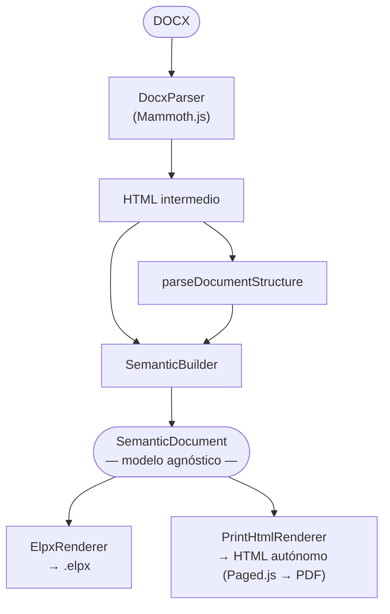
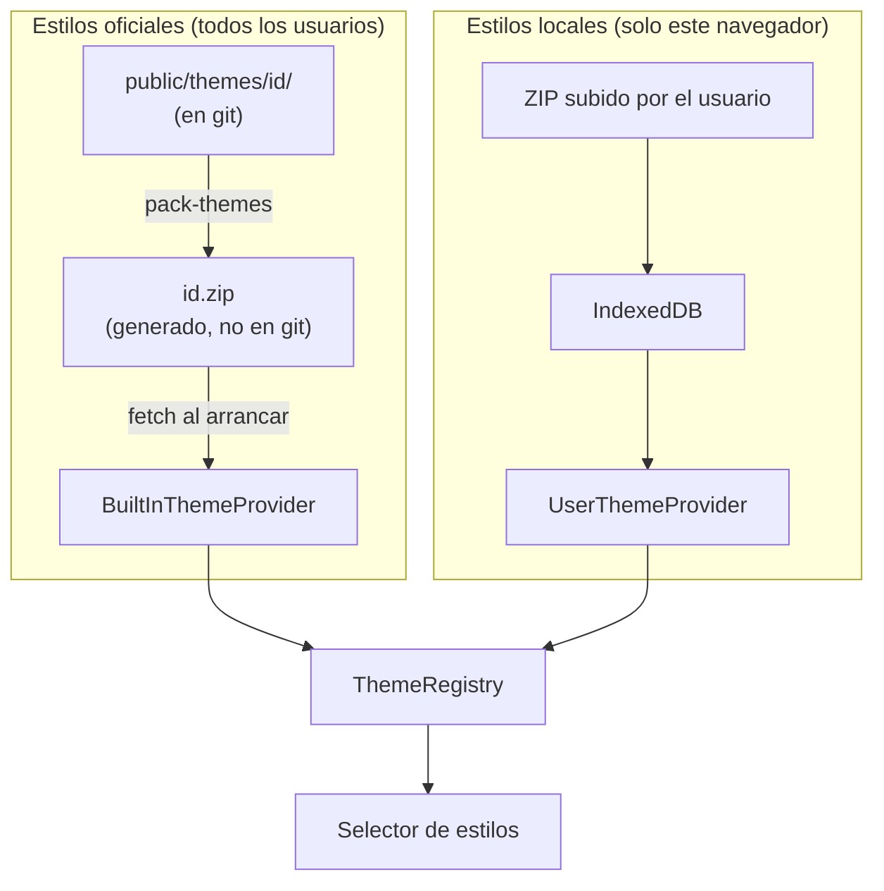
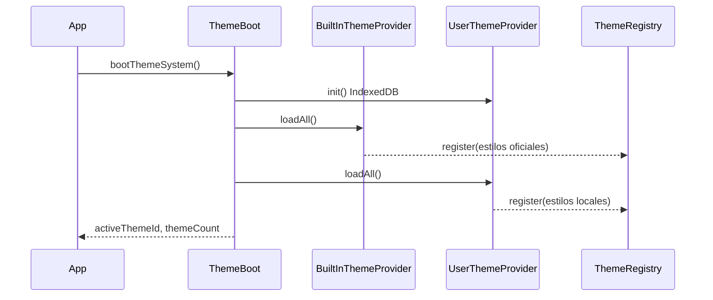

# Arquitectura — BUA ConvertidoreXe

## Pipeline de conversión (3 capas)



**SemanticDocument** es el núcleo: un modelo puro y agnóstico que describe el documento como páginas y bloques semánticos. Los renderers ELPX y print son completamente independientes entre sí.

---

## Modelo SemanticDocument

```typescript
interface SemanticDocument {
  title: string;
  subtitle: string;
  pages: SemanticPage[];
}

interface SemanticPage {
  title: string;
  level: 1 | 2 | 3 | 4;
  parentIndex: number | null;
  blocks: SemanticBlock[];
}

interface SemanticBlock {
  title: string;   // 'Contenido' = bloque sin título de iDevice
  html: string;
}
```

---

## Sistema de estilos (ThemeSystem)

Los estilos son plugins ZIP cargados en runtime, sin backend:



### Secuencia de arranque (ThemeBoot.ts)



| Servicio | Responsabilidad |
|---|---|
| `BuiltInThemeProvider` | Carga ZIPs de `public/` via fetch |
| `UserThemeProvider` | Persistencia IndexedDB (idb) |
| `ThemeValidator` | Valida estructura mínima del ZIP |
| `ThemeRegistry` | Fuente de verdad (`Map<id, ThemeBundle>`) |
| `ThemeCssManager` | Inyección CSS con `id="theme-css"` |
| `BlobUrlRegistry` | Ciclo de vida de Blob URLs |

---

## Estructura de un ZIP de tema

```
{ThemeId}.zip/
├── style.css          # REQUERIDO — incluye Paleta, clases BUA
├── config.xml         # REQUERIDO — metadatos del tema
├── style.js           # Opcional
├── screenshot.png     # Preview en el selector
├── portada_pdf.png    # Imagen de portada para PDF
└── img/
    ├── logo_BUA.png   # Encabezado PDF
    ├── logo_UA.png    # Pie de página PDF
    └── logo_CID.png   # Opcional
```

El CSS debe incluir:
- Comentario `Paleta: #color1 · #color2 ...` para extracción de colores
- Clases `.bua_ejemplo`, `.bua_definicion`, `.bua_importante`
- `::before { content: "Etiqueta" }` en cada clase BUA (multilingüe)

---

## Renderer HTML Print / PDF

El renderer de impresión vive en `src/core/renderers/html-print/` y no contamina el pipeline DOCX → ELPX.

| Elemento | Descripción |
|---|---|
| **Portada** | Imagen del tema, logo BUA, título, subtítulo, año, licencia CC |
| **Índice** | TOC con paginación automática via `target-counter()` (Paged.js) |
| **Encabezado** | Logo BUA + título del documento |
| **Pie de página** | Logo UA + número de página |
| **Cajas BUA** | Colores y etiquetas extraídos del CSS del tema |

### Detección de idioma

1. Etiquetas BUA en CSS (`"Exemple"` → ca, `"Example"` → en, `"Ejemplo"` → es)
2. Palabras clave del ID (`PhD` → en, `Doctorat` → ca)
3. Fallback: `es`

---

## Metadatos del ELPX generado

| Campo | Valor |
|---|---|
| `pp_author` | `Biblioteca de la Universidad de Alicante` |
| `pp_lang` | `es` |
| `pp_license` | `creative commons: attribution - non commercial - share alike 4.0` |
| `pp_licenseUrl` | `https://creativecommons.org/licenses/by-nc-sa/4.0/` |
| `pp_theme` | ID del tema seleccionado |

---

## Puntos de extensión

### Añadir una nueva opción de H2
1. Añadir al tipo `H2StructureOption` en `src/types/index.ts`
2. Añadir al union en `src/core/models/SemanticDocument.ts`
3. Implementar lógica en `SemanticBuilder.ts`
4. Añadir etiqueta en `StructureConfigurator.tsx`

### Añadir un nuevo renderer de salida
1. Crear `src/core/renderers/{nombre}/`
2. La función de entrada recibe `SemanticDocument` y devuelve el formato
3. **No modificar** `SemanticDocument`, `docxToSemanticDocument.ts` ni ElpxRenderer

### Añadir nuevas clases BUA
1. `HtmlTransformer.ts` — detección y asignación de clases
2. CSS del tema — estilos visuales
3. `printStyles.css` — estilos equivalentes para PDF
4. `PrintThemeLoader.ts` — extracción de colores/etiquetas
